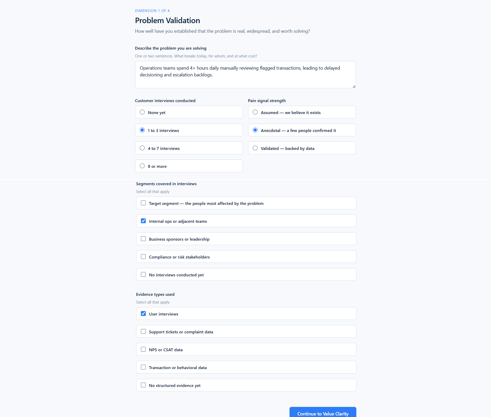
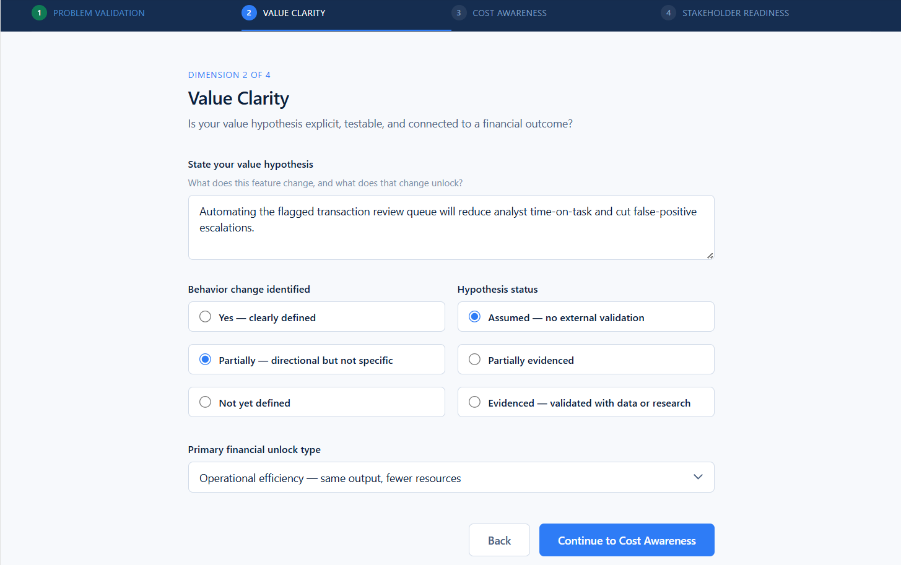
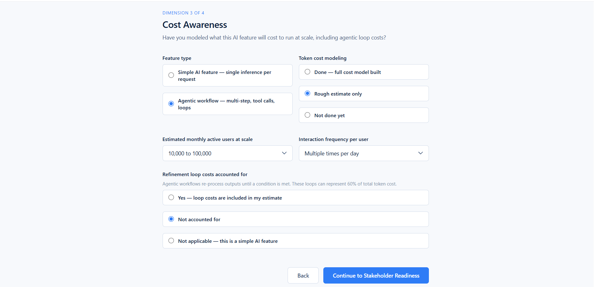
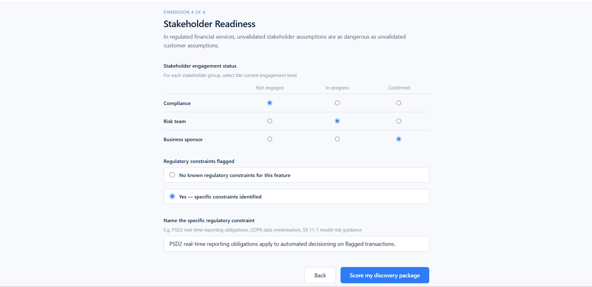
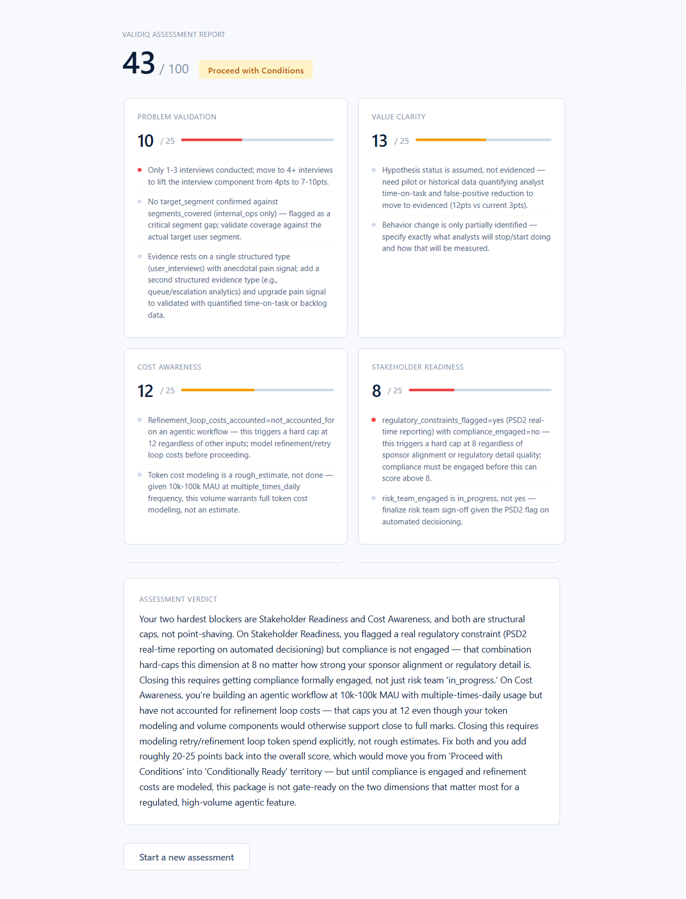

# ValidIQ Discovery-to-ROI Confidence Scorer

**ValidIQ** is an AI-powered tool for enterprise financial services Product Managers. It evaluates a PM's discovery package before they commit to build, scoring it across four dimensions and returning a scored artifact they can take into a sprint 0 gate or stage gate review.

Built by [Rishendra Vikram Singh](https://rishendra125.github.io) · Part of the [AI Solutions Portfolio](https://rishendra125.github.io)

**Live demo:** [rishendra125.github.io/validiq_project](https://rishendra125.github.io/validiq_project) · **Repo:** [github.com/rishendra125/validiq_project](https://github.com/rishendra125/validiq_project)

---

## The problem it solves

Enterprise financial services companies including JP Morgan, Mastercard, AMEX, and Visa are running hundreds of AI pilots but struggling to move them to production. The failure is not technical. It happens earlier, at the discovery stage, because PMs are committing to build without validating whether the problem is real, whether the value hypothesis is evidenced, whether the token economics hold at scale, and whether compliance and risk stakeholders are aligned before the first sprint begins.

In regulated environments, those gaps do not surface as sprint retrospective notes. They surface as compliance escalations, stage gate failures, and programs that get walked back after months of investment. ValidIQ intercepts at the discovery stage, the only point where the decision can still be changed at zero cost.

---

## How it works

ValidIQ is a single HTML file. No backend. No database. No login. The PM brings their own Anthropic API key it is used only in the browser and never sent to any server other than `api.anthropic.com` directly.

**Flow:**

1. Enter your Anthropic API key on the gate screen
2. Complete a structured four-screen form covering the four scoring dimensions
3. Submit ValidIQ sends your inputs to Claude via the Anthropic API using your key
4. Receive a scored artifact with dimension scores, gap statements, an overall rating, and a verdict paragraph written for a gate meeting

Total time to complete: under 10 minutes.

---

## Screenshots

**Problem Validation screen (Dimension 1 of 4)**
Captures interview count, segment coverage, evidence types, and pain signal strength. Scores whether the PM has established that the problem is real, widespread, and worth solving before committing to build.



**Value Clarity screen (Dimension 2 of 4)**
Captures the value hypothesis, behavior change identification, financial unlock type, and hypothesis status. Scores whether the PM can connect the feature to a specific, testable, and financially grounded outcome.



**Cost Awareness screen (Dimension 3 of 4)**
Captures feature type, token cost modeling status, estimated user volume, interaction frequency, and refinement loop cost awareness. Scores whether the PM has modeled what the AI feature will actually cost to run at scale, including agentic loop costs that McKinsey data shows account for 60% of total agentic spend.



**Stakeholder Readiness screen (Dimension 4 of 4)**
Captures compliance, risk, and business sponsor engagement status, plus any named regulatory constraints. Scores whether the PM has engaged the right stakeholders before sprint 0, not after. In regulated financial services, an unvalidated stakeholder assumption is as dangerous as an unvalidated customer assumption.



**Scored output artifact**
The scored report shows each dimension out of 25 with a colour signal, specific gap statements tied to the PM's actual inputs, an overall score out of 100, a rating label, and a verdict paragraph written for a gate meeting audience.



---

## Scoring dimensions

| Dimension | Max Score | What it measures |
|---|---|---|
| Problem Validation | 25 | Customer interviews, segment coverage, evidence type, pain signal strength |
| Value Clarity | 25 | Value hypothesis, behavior change, financial unlock type, evidenced vs assumed |
| Cost Awareness | 25 | Token cost modeling, agentic loop costs, volume and frequency at scale |
| Stakeholder Readiness | 25 | Compliance, risk, business sponsor engagement, regulatory constraints |

**Overall rating thresholds:**

| Score | Rating |
|---|---|
| 0 to 40 | Return to Discovery |
| 41 to 60 | Proceed with Conditions |
| 61 to 80 | Conditionally Ready |
| 81 to 100 | Ready to Proceed |

The scoring rubric applies hard caps and gates before stacking points. For example: an agentic workflow with no cost modeling done is hard-capped at 8 regardless of other inputs. Regulatory constraints flagged with compliance not engaged is hard-capped at 8. These reflect real failure modes in regulated AI delivery, not arbitrary penalties.

---

## Why ValidIQ is built this way

### Why these four dimensions and not others

The four dimensions map directly to the four most common failure modes in enterprise AI delivery in financial services, each sourced from primary research.

**Problem Validation** addresses the Mastercard finding that 85% of organizations could place greater focus on customer needs meaning discovery is being skipped or rushed before build commitment.

**Value Clarity** addresses the Deloitte and Accenture finding that only 23-28% of organizations report clear measurable value from AI meaning the value hypothesis is either missing or untested at the point PMs are already committing to sprint 0.

**Cost Awareness** addresses the McKinsey finding that 60% of agentic task costs come from refinement loops that PMs are not modeling when scoping features.

**Stakeholder Readiness** addresses the JP Morgan principle that in regulated environments decisions do not get walked back meaning compliance and risk must be engaged before build, not discovered as a blocker after sprint 0 has started.

Each dimension is not an opinion about good product management. It is a documented failure mode with a named source.

### Why 25 points each

Equal weighting is a deliberate choice. In financial services, a weak score in any single dimension is enough to kill a program. A technically validated problem with no compliance engagement is just as dangerous as a well-governed feature built on an assumption. Equal weighting signals that all four dimensions are non-negotiable the rubric is not a checklist where a high score in one area can compensate for a low score in another.

### Why the hard caps

The agentic workflow cap at 8 with no cost modeling exists because of the McKinsey finding on refinement loops, combined with published data showing token prices up 60% since late 2025 driven almost entirely by agentic workflows. A PM who builds an agentic feature without cost modeling is not just missing a number they are approving a feature with a structurally unpredictable cost profile in an environment where finance now treats AI spend like a utility bill. That is a programme risk, not a gap to optimise around.

The regulatory constraints plus no compliance engagement cap at 8 exists because Mastercard explicitly stated there is no margin for move fast and fix it later when AI informs payment authorization, fraud detection, identity or risk decisions. A PM who has identified a regulatory constraint and not engaged compliance has not just missed a step they have created a contradiction in their own discovery package that no stage gate in a regulated institution should pass.

### Why these thresholds

**Return to Discovery (below 40)** means the package has fundamental gaps across multiple dimensions. No single strong dimension can compensate.

**Proceed with Conditions (41-60)** means the concept is viable but specific named gaps must be closed before sprint 0 commitment.

**Conditionally Ready (61-80)** means minor gaps that a PM can address in parallel with early sprint work.

**Ready to Proceed (above 80)** means the discovery package is defensible in a stage gate with a senior risk or compliance stakeholder in the room.

The thresholds are not arbitrary percentages. They reflect the stage gate logic that enterprise financial services teams already use. ValidIQ is translating a judgment call that currently lives in a senior PM's head into a structured, evidence-based score.

---

## Sample test scenarios

Three ready-to-run scenarios to verify the scoring logic. Each is designed to hit a different rating band.

---

**Scenario A: Proceed with Conditions (expected score 43)**

This is the agentic workflow scenario with a compliance contradiction. It tests that hard caps fire correctly.

| Field | Input |
|---|---|
| Problem statement | Operations teams spend 4+ hours daily manually reviewing flagged transactions, leading to delayed decisioning and escalation backlogs |
| Interviews conducted | 1 to 3 |
| Segments covered | Internal ops only |
| Evidence types | User interviews only |
| Pain signal | Anecdotal |
| Value hypothesis | Automating the flagged transaction review queue will reduce analyst time-on-task and cut false-positive escalations |
| Behavior change | Partially identified |
| Financial unlock | Operational efficiency |
| Hypothesis status | Assumed |
| Feature type | Agentic workflow |
| MAU at scale | 10,000 to 100,000 |
| Interaction frequency | Multiple times daily |
| Token cost modeling | Rough estimate only |
| Refinement loops | Not accounted for |
| Compliance | Not engaged |
| Risk team | In progress |
| Business sponsor | Confirmed |
| Regulatory constraints | Yes: PSD2 real-time reporting obligations apply to automated decisioning on flagged transactions |

Expected dimension scores: Problem Validation 10, Value Clarity 13, Cost Awareness 12, Stakeholder Readiness 8. Total 43. Rating: Proceed with Conditions.

What this tests: the agentic workflow plus unaccounted refinement loops cap at 12 on Cost Awareness, and the regulatory constraint plus no compliance engagement cap at 8 on Stakeholder Readiness.

---

**Scenario B: Conditionally Ready (expected score ~79)**

Strong discovery, simple AI feature, minor stakeholder gap.

| Field | Input |
|---|---|
| Problem statement | Relationship managers at Tier 1 corporate clients spend 3 hours per week manually compiling portfolio risk summaries that could be auto-generated from existing data |
| Interviews conducted | 8 or more |
| Segments covered | Target segment and business sponsors |
| Evidence types | User interviews and transaction data |
| Pain signal | Validated with data |
| Value hypothesis | AI-generated risk summaries will return 3 hours per RM per week and increase client meeting frequency by 20%, directly supporting AUM growth targets |
| Behavior change | Yes, clearly defined |
| Financial unlock | Revenue increase |
| Hypothesis status | Partially evidenced |
| Feature type | Simple AI feature |
| MAU at scale | 1,000 to 10,000 |
| Interaction frequency | Daily |
| Token cost modeling | Done |
| Refinement loops | Not applicable |
| Compliance | In progress |
| Risk team | Confirmed |
| Business sponsor | Confirmed |
| Regulatory constraints | None flagged |

Expected score: approximately 79. Rating: Conditionally Ready.

What this tests: the high interview count and target segment coverage pushing Problem Validation to near-maximum, the partially evidenced hypothesis with a defined financial unlock lifting Value Clarity, and the simple AI feature with full cost modeling clearing Cost Awareness cleanly. The only drag is compliance at in progress rather than confirmed, which keeps Stakeholder Readiness from a perfect score.

---

**Scenario C: Return to Discovery (expected score ~19)**

Classic pre-mature build attempt with no validation across any dimension.

| Field | Input |
|---|---|
| Problem statement | Customers want faster loan approvals |
| Interviews conducted | None |
| Segments covered | None |
| Evidence types | None |
| Pain signal | Assumed |
| Value hypothesis | AI will make approvals faster and customers will be happier |
| Behavior change | Not yet defined |
| Financial unlock | Not yet defined |
| Hypothesis status | Assumed |
| Feature type | Agentic workflow |
| MAU at scale | Under 1,000 |
| Interaction frequency | One-time |
| Token cost modeling | Not done |
| Refinement loops | Not accounted for |
| Compliance | Not engaged |
| Risk team | Not engaged |
| Business sponsor | Not engaged |
| Regulatory constraints | Yes (leave detail blank) |

Expected score: approximately 19. Rating: Return to Discovery.

What this tests: the zero-interview floor on Problem Validation, the not-yet-defined financial unlock cap on Value Clarity, the agentic plus no cost modeling hard cap on Cost Awareness, and the regulatory plus no compliance hard cap on Stakeholder Readiness all fire simultaneously.

---

## File structure

```
validiq/
├── index.html              # The entire application — form flow, scoring logic, API call, output render
├── README.md               # This file
└── screenshots/
    ├── validiq_stage1.png  # Problem Validation screen
    ├── validiq_stage2.png  # Value Clarity screen
    ├── validiq_stage3.png  # Cost Awareness screen
    ├── validiq_stage4.png  # Stakeholder Readiness screen
    └── validiq_FinatOutput.png  # Scored output artifact
```

Everything lives in `index.html`. There is no build step, no package.json, no node_modules, no external CSS or JS files. The Anthropic API system prompt, the scoring rubric, the form flow, the rendering logic, and the demo data are all self-contained in a single file. Any static host can serve it.

---

## Running locally

No build step required. Just open `index.html` in any modern browser.

```bash
git clone https://github.com/rishendra125/validiq.git
cd validiq
open index.html
```

You will need an Anthropic API key. Get one free at [console.anthropic.com](https://console.anthropic.com).

---

## Deploying to GitHub Pages

1. Fork or clone this repo
2. Go to repo Settings > Pages
3. Set source to main branch, root directory
4. Your live URL will be `https://<your-username>.github.io/validiq`

---

## Tech stack

- Vanilla HTML, CSS, JavaScript no frameworks, no build tools
- Anthropic API (`claude-sonnet-4-6`) via direct browser fetch
- Single file, fully self-contained
- Works on GitHub Pages, Netlify, Vercel, or any static host

---

## Research behind the rubric

The four scoring dimensions and their gates are grounded in published research on AI pilot failure in financial services:

- **Mastercard (2026):** 73% of organizations struggle to integrate data across systems; 85% report they could place greater focus on customer needs; 86% say difficulty testing pilots on a small scale is hurting their ability to innovate
  - [How to govern AI at scale and build trust in AI-driven decisions](https://www.mastercard.com/us/en/news-and-trends/Insights/2026/how-to-govern-ai-at-scale-and-build-trust-in-ai-driven-decisions.html)
  - [De-risking AI innovation in retail: What the research reveals](https://www.mastercard.com/global/en/news-and-trends/Insights/2026/de-risking-ai-innovation-in-retail-what-the-research-reveals.html)
  - [Scaling AI: No margin for move fast](https://www.mastercard.com/us/en/news-and-trends/stories/2026/scaling-ai.html)

- **Deloitte (January 2026):** Only 28% of global finance leaders report clear measurable value from their AI investments; AI has become the single fastest-growing line item in corporate technology budgets
  - [How to navigate the economics of AI](https://www.deloitte.com/us/en/services/consulting/articles/how-to-navigate-economics-of-ai.html)
  - [CFO guide to AI token economics](https://www.deloitte.com/us/en/services/consulting/articles/cfo-guide-ai-token-economics.html)

- **Accenture:** Only 23% of C-suite leaders report widespread and sustained business value from AI; most companies manage token costs reactively when the bill arrives rather than at the product hypothesis stage
  - [AI data tokenomics](https://www.accenture.com/en/insights/ai-data/ai-data-tokenomics)

- **McKinsey (July 2026):** 60% of agentic task costs come from refinement loops a cost pattern PMs are not accounting for when scoping AI features
  - [Cost versus value: Managing agentic AI system performance](https://www.mckinsey.com/capabilities/quantumblack/our-insights/cost-versus-value-managing-agentic-ai-system-performance)

- **JP Morgan:** In regulated environments, AI decisions do not get walked back and trust, once lost, is difficult to regain meaning unvalidated assumptions carry downstream compliance and risk consequences that do not exist in other industries
  - [AI in payments: Efficiency and fraud reduction](https://www.jpmorgan.com/insights/payments/security-trust/ai-payments-efficiency-fraud-reduction)

---

## Part of the AI Solutions Portfolio

ValidIQ is one of several single-purpose AI tools built for enterprise product and delivery professionals.

| Tool | What it does |
|---|---|
| **ValidIQ** | Discovery-to-ROI confidence scorer for finserv PMs |
| **PropelIQ** | Commercial proposal intelligence |
| **BriefCast** | AI-powered stakeholder reporting generator |
| **RetroLoop** | Sprint retrospective pattern recognition |

Full portfolio: [rishendra125.github.io](https://rishendra125.github.io)

---

## License

MIT free to use, fork, and adapt with attribution.
